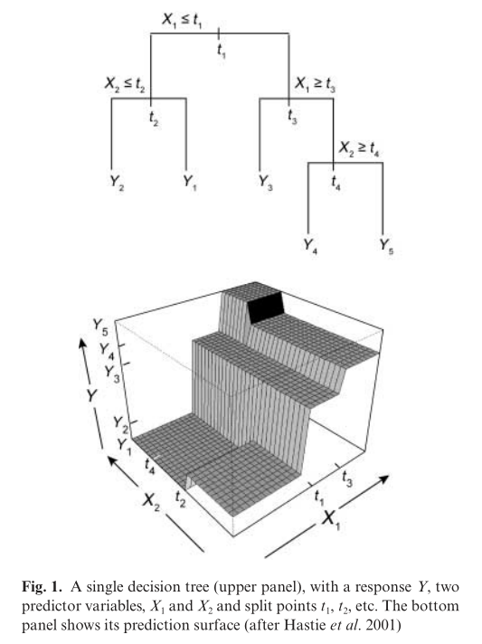

<!-- TOC -->

- [BRT阅读笔记](#brt阅读笔记)
    - [相关背景](#相关背景)
    - [模型介绍](#模型介绍)
        - [决策树](#决策树)

<!-- /TOC -->
# BRT阅读笔记

## 相关背景

提升回归树(BRT)，是一种用来拟合统计模型的集合方法，他集合了Regression Trees 和 Boosting 两种方法的优点。最终的BRT模型可以被理解为一个加法回归模型，其中各个项是简单的树，以前向的、阶段性的方式进行拟合。

BRT可以处理不同类型的预测变量并适应缺失数据。它们不需要事先进行数据转换或消除异常值，可以适应复杂的非线性关系，并自动处理预测变量之间的交互效应。在BRT中拟合多棵树，克服了单棵树模型的最大缺点：其预测性能相对较差。尽管BRT模型很复杂，但它们可以通过总结的方式给予强大的生态学洞察力，其预测性能优于大多数传统的建模方法。

## 模型介绍

BRT主要使用两种算法，回归树就是用于分类的树(决策树)的模型组，而boosting则是对这些模型进行组合

### 决策树

基于树的预测器模型将空间划分为矩形，然后使用一系列的规则确定同质的区域。然后，为每个区域拟合一个常数，分类树拟合最可能的类别作为常数，回归树拟合该区域观测值的平均响应。在上图中，两个预测变量$X_1,X_2$可能是温度和降雨量，$Y$可能表示一个成体的平均重量，区域$Y_1,Y_2$表示终端节点或者叶子。$t_1,t_2$等是分割点，其作用是为了最小化预测误差。

树对异常值不敏感，并且可以通过使用替代品允许少许数据的缺失，但也有一些缺陷，比如树很难模拟平滑的函数，并且树的结构取决于数据样本，微小的数据变化可能导致树出现一系列差异很大的分支。因此，这些因素都限制了树的预测性能。