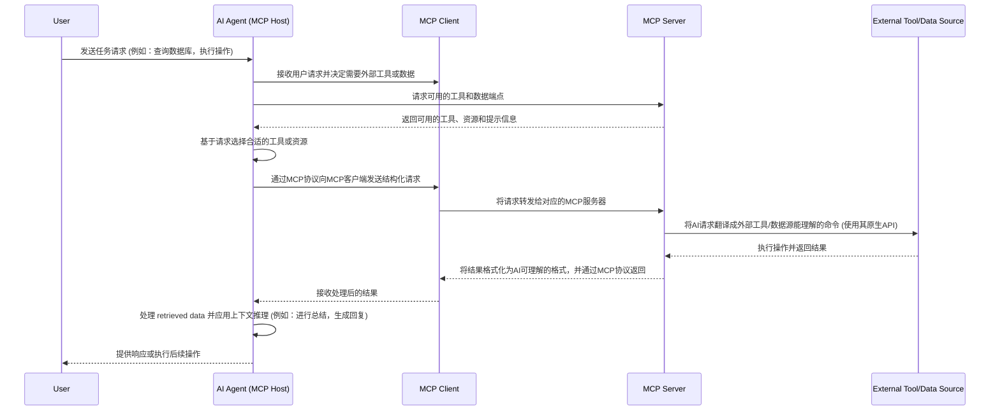

<!-- TOC -->

- [mcp学习](#mcp学习)
    - [介绍](#介绍)
    - [使用Spring AI创建mcp server](#使用spring-ai创建mcp-server)
        - [基本概念](#基本概念)
        - [基于stdio的mcp服务端实现](#基于stdio的mcp服务端实现)
        - [基于SSE的mcp服务端实现](#基于sse的mcp服务端实现)
    - [使用Spring AI创建mcp client](#使用spring-ai创建mcp-client)
        - [基于stdio的mcp client实现](#基于stdio的mcp-client实现)
        - [基于SSE的mcp client实现](#基于sse的mcp-client实现)
    - [agent使用mcp的工作流程](#agent使用mcp的工作流程)
    - [SSE和Streamable HTTP的对比](#sse和streamable-http的对比)
        - [SSE（Server-Sent Events）的问题](#sseserver-sent-events的问题)
        - [Streamable HTTP的优势](#streamable-http的优势)

<!-- /TOC -->
# mcp学习

## 介绍
模型上下文协议（model context protocol）是由Anthropic提出的一种协议，它给LLM和各类工具提供了一种标准化的桥梁，让LLM可以使用各种工具和API。

## 使用Spring AI创建mcp server

### 基本概念
Spring AI MCP包括以下组件：
- Spring AI服务端：使用Spring AI框架构建想要通过MCP访问数据的AI应用程序。
- Spring MCP客户端：MCP协议的spring ai实现，一个客户端可以配置多个mcp server

此外，Spring提供了两种机制快速搭建mcp server：
- 基于stdio的进程间通信传输，以独立的进程运行在本地，比较适合轻量级的工具
- 基于SSE（server sent events）进行远程服务访问，适合mcp server部署在远程服务器上，客户端通过http请求等方式访问。

### 基于stdio的mcp服务端实现

1. 添加依赖
```xml
<dependency>
    <groupId>org.springframework.ai</groupId>
    <artifactId>spring-ai-mcp-server-spring-boot-starter</artifactId>
</dependency>
```
2. 在`application.yml`中配置mcp服务端
```yaml
spring:
    main:
        web-application-type: none # 禁用web应用程序类型
        banner-mode: off # 禁用banner
    ai:
        mcp:
            server:
                stdio: true
                name: my-weather-server
                version: 0.0.1
```
3. 实现mcp工具，通过`@Tool`注解标记工具方法，其中`decription`可以添加对工具的描述，`@ToolParameter`可以标明工具具体的接收参数。
```java
@Service

public class WeatherTool {

    private final WebClient webClient;

    public WeatherTool(WebClient.Builder webClientBuilder) {
        this.webClient = webClientBuilder
            .baseUrl("https://api.open-meteo.com/v1")
            .build();
    }

    @Tool(description = "根据经纬度获取天气预报")
    public String getWeatherForecast(
            @ToolParameter(description = "纬度，如39.9042") String latitude,
            @ToolParameter(description = "经度，如116.4074") String longitude) {
        try {
            String response = webClient.get()
                .uri(uriBuilder -> uriBuilder
                    .path("/forecast")
                    .queryParam("latitude", latitude)
                    .queryParam("longitude", longitude)
                    .queryParam("current", "temperature_2m,wind_speed_10m")
                    .queryParam("timezone", "auto")
                    .build())
                .retrieve()
                .bodyToMono(String.class)
                .block();
            return "天气信息"+ response;
        } catch (Exception e) {
            return "Error fetching weather data: " + e.getMessage();
        }
    }

    @Tool(description = "根据经纬度获取空气质量信息")
    public String getAirQuality(
            @ToolParameter(description = "纬度，如39.9042") String latitude,
            @ToolParameter(description = "经度，如116.4074") String longitude) {
        try {
            String response = webClient.get()
                .uri(uriBuilder -> uriBuilder
                    .path("/air-quality")
                    .queryParam("latitude", latitude)
                    .queryParam("longitude", longitude)
                    .queryParam("timezone", "auto")
                    .build())
                .retrieve()
                .bodyToMono(String.class)
                .block();
            return "空气质量信息" + response;
        } catch (Exception e) {
            return "Error fetching air quality data: " + e.getMessage();
        }
    }
}
```
4. 注册mcp工具，主要是返回`ToolCallbackProvider`的bean
```java
@Bean
public ToolCallbackProvider weatherTools(WeatherTool weatherTool) {
    return MethodToolCallbackProvider.builder()
            .toolObjects(weatherTool)
            .build();
}
```

5. 启动应用程序，mcp服务端会监听标准输入输出流，等待客户端的请求。

### 基于SSE的mcp服务端实现
基于SSE的mcp服务端通过http协议进行通信，适合远程服务访问，具体流程与stdio非常类似

1. 添加依赖
```xml
<dependency>
    <groupId>org.springframework.ai</groupId>
    <artifactId>spring-ai-mcp-server-webflux-spring-boot-starter</artifactId>
</dependency>

```
2. 在`application.yml`中配置mcp服务端
```yaml
server:
    port: 8080 # 设置端口号
spring:
    ai:
        mcp:
            server:
                name: my-weather-server
                version: 0.0.1
```
3. 实现mcp工具，通过`@Tool`注解标记工具方法，其中`decription`可以添加对工具的描述，`@ToolParameter`可以标明工具具体的接收参数。
```java
@Service

public class WeatherTool {

    private final WebClient webClient;

    public WeatherTool(WebClient.Builder webClientBuilder) {
        this.webClient = webClientBuilder
            .baseUrl("https://api.open-meteo.com/v1")
            .build();
    }

    @Tool(description = "根据经纬度获取天气预报")
    public String getWeatherForecast(
            @ToolParameter(description = "纬度，如39.9042") String latitude,
            @ToolParameter(description = "经度，如116.4074") String longitude) {
        try {
            String response = webClient.get()
                .uri(uriBuilder -> uriBuilder
                    .path("/forecast")
                    .queryParam("latitude", latitude)
                    .queryParam("longitude", longitude)
                    .queryParam("current", "temperature_2m,wind_speed_10m")
                    .queryParam("timezone", "auto")
                    .build())
                .retrieve()
                .bodyToMono(String.class)
                .block();
            return "天气信息"+ response;
        } catch (Exception e) {
            return "Error fetching weather data: " + e.getMessage();
        }
    }

    @Tool(description = "根据经纬度获取空气质量信息")
    public String getAirQuality(
            @ToolParameter(description = "纬度，如39.9042") String latitude,
            @ToolParameter(description = "经度，如116.4074") String longitude) {
        try {
            String response = webClient.get()
                .uri(uriBuilder -> uriBuilder
                    .path("/air-quality")
                    .queryParam("latitude", latitude)
                    .queryParam("longitude", longitude)
                    .queryParam("timezone", "auto")
                    .build())
                .retrieve()
                .bodyToMono(String.class)
                .block();
            return "空气质量信息" + response;
        } catch (Exception e) {
            return "Error fetching air quality data: " + e.getMessage();
        }
    }
}
```
4. 注册mcp工具，主要是返回`ToolCallbackProvider`的bean
```java
@Bean
public ToolCallbackProvider weatherTools(WeatherTool weatherTool) {
    return MethodToolCallbackProvider.builder()
            .toolObjects(weatherTool)
            .build();
}
```

5. 启动应用程序，mcp服务端会监听HTTP请求，等待客户端的请求。

## 使用Spring AI创建mcp client
客户端同样通过stdio或SSE两种方式进行通信，具体流程与服务端类似。
### 基于stdio的mcp client实现
1. 添加依赖
```xml
<dependency>
    <groupId>org.springframework.ai</groupId>
    <artifactId>spring-ai-mcp-client-spring-boot-starter</artifactId>
</dependency>
```
2. 在`application.yml`中配置mcp服务器
```yaml
spring:
    ai:
        dashscope:
            api-key: YOUR_API_KEY # 替换为你的API密钥
        mcp:
            client:
                stdio:
                    servers-configuration: classpath:/mcp-servers-config.json # MCP服务器配置文件路径
```

3. 创建MCP服务器配置文件`mcp-servers-config.json`，内容如下：
```json
{
  "mcpServers":{
    //定义名为"weather"的MCP服务器
    "weather":{
        //指定启动命令
        "command": "java",
        "args":[
            "-Dspring.ai.mcp.server.stdio=true",
            "-Dspring.main.web-application-type=none",
            "-jar",
            "path/to/your/weather-server.jar"  # 替换为你的MCP服务器JAR包路径
        ],
        //指定环境变量
        "env": {}
    }
    // 可以添加更多的MCP服务器配置
  }
}
```
4. 编写启动类进行测试
```java
@SpringBootApplication
public class McpClientApplication {

    public static void main(String[] args) {
        SpringApplication.run(McpClientApplication.class, args);
    }

    @Bean
    public CommandLineRunner predefineQuestions(
        ChatClient.Builder chatClientBuilder,
        ToolCallbackProvider tools,
        ConfigurableApplicationContext context
    ) {
        return args -> {
            // 创建ChatClient实例
            var chatClient = chatClientBuilder
                .defaultTools(tools) //传入预定义的工具
                .build();

            // 定义预设问题
            String question1 = "请告诉我北京的天气预报";
            
            // 打印问题
            System.out.println("问题: " + question1);

            //调用LLM并打印响应
            System.out.println("响应: " + chatClient.prompt(question1)
                .call()
                .content());
            
            context.close();
        };    
                
    }
}
```

### 基于SSE的mcp client实现
1. 添加依赖
```xml
<dependency>
    <groupId>org.springframework.ai</groupId>
    <artifactId>spring-ai-mcp-client-webflux-spring-boot-starter</artifactId>
</dependency>
```

2. 在`application.yml`中配置mcp服务器
```yaml
spring:
    ai:
        dashscope:
            api-key: YOUR_API_KEY # 替换为你的API密钥
        mcp:
            client:
                sse:
                    connections:
                        server1:
                            url: http://localhost:8080 //替换为你的MCP服务器地址
                        server2: xxxx
```

3. 编写启动类进行测试
```java
@SpringBootApplication
public class McpClientApplication {

    public static void main(String[] args) {
        SpringApplication.run(McpClientApplication.class, args);
    }

    @Bean
    public CommandLineRunner predefineQuestions(
        ChatClient.Builder chatClientBuilder,
        ToolCallbackProvider tools,
        ConfigurableApplicationContext context
    ) {
        return args -> {
            // 创建ChatClient实例
            var chatClient = chatClientBuilder
                .defaultTools(tools) //传入预定义的工具
                .build();

            // 定义预设问题
            String question1 = "请告诉我北京的天气预报";
            
            // 打印问题
            System.out.println("问题: " + question1);

            //调用LLM并打印响应
            System.out.println("响应: " + chatClient.prompt(question1)
                .call()
                .content());
            
            context.close();
        };    
                
    }
}
```

## agent使用mcp的工作流程

工作流程解释：

- **用户发起请求**: 用户向AI Agent发送一个任务请求，这可能是一个需要访问外部信息或执行特定操作的查询。
- **AI Agent决策**: AI Agent (作为MCP Host) 接收到用户请求后，会通过其内部逻辑判断是否需要与外部工具或数据源交互来完成任务。
- **工具发现**: AI Agent向连接的MCP服务器请求其可提供的工具、资源和预定义提示的列表。MCP服务器会告知AI Agent它所能提供的功能（例如，列出文件、查询数据库等）。
- **选择工具**: AI Agent根据用户请求和MCP服务器提供的能力，决定调用哪个合适的工具或资源。
- **发送结构化请求**: AI Agent通过MCP客户端，遵循MCP协议，向选定的MCP服务器发送一个结构化请求，其中包含所需操作的参数。
- **MCP服务器执行**: MCP服务器接收到请求后，将其翻译成外部工具或数据源能够理解的原生API调用或命令。
- **外部系统响应**: 外部工具或数据源执行相应的操作（例如，查询数据库、创建工单、读取文件等）并返回结果给MCP服务器。
- **结果格式化与返回**: MCP服务器将从外部系统获得的结果格式化为AI Agent可以理解的统一格式，然后通过MCP客户端返回给AI Agent。
- **AI Agent处理**: AI Agent接收到结果后，会对其进行处理，应用其上下文推理能力，例如对数据进行总结，或根据结果生成最终响应。
- **用户收到响应**: AI Agent将最终的响应或执行的操作结果反馈给用户。

## SSE和Streamable HTTP的对比

### SSE（Server-Sent Events）的问题

- **不支持断线重连/恢复**
当 SSE 连接断开时，所有会话状态丢失，客户端必须重新建立连接并初始化整个会话。例如，正在执行的大型文档分析任务会因 WiFi 不稳定而完全中断，迫使用户重新开始整个过程。

- **服务器需维护长连接**
服务器必须为每个客户端维护一个长时间的 SSE 连接，大量并发用户会导致资源消耗剧增。当服务器需要重启或扩容时，所有连接都会中断，影响用户体验和系统可靠性。

- **服务器消息只能通过 SSE 传递**
即使是简单的请求-响应交互，服务器也必须通过 SSE 通道返回信息，造成不必要的复杂性和开销。对于某些环境（如云函数）不适合长时间保持 SSE 连接。

- **基础设施兼容性限制**
许多现有的 Web 基础设施如 CDN、负载均衡器、API 网关等可能不能正确处理长时间的 SSE 连接，企业防火墙可能会强制关闭超时连接，导致服务不可靠。

### Streamable HTTP的优势

相比原有 HTTP+SSE 机制，Streamable HTTP 引入了几项关键改进：

- 统一 Endpoint：移除专门的 `/sse` 端点，所有通信通过单一端点（当前官方 sdk 实现为 `/mcp`）进行
- 按需流式传输：服务器可灵活选择是返回普通 HTTP 响应还是升级为 SSE 流
- 会话标识：引入会话 ID 机制，支持状态管理和恢复
- 灵活初始化：客户端可通过空 GET 请求主动初始化 SSE 流

